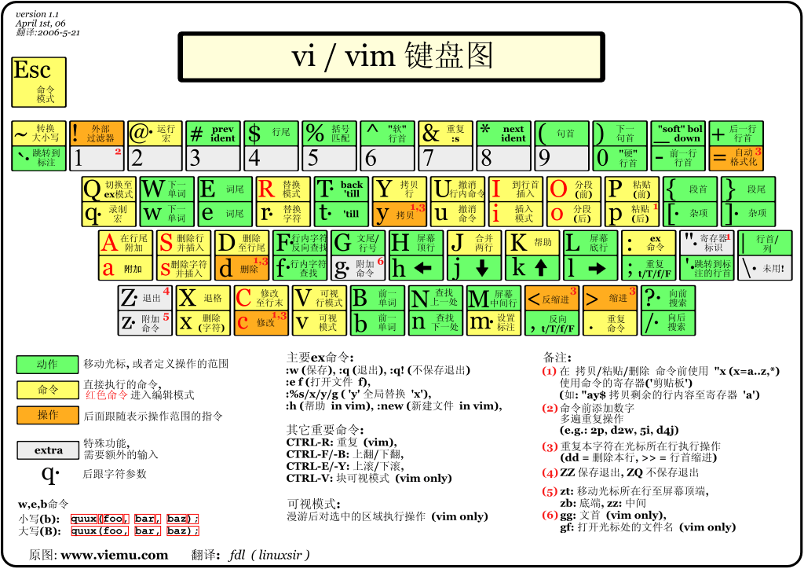

# vim

## 命令模式常用命令

- `i`切换到输入模式，在光标当前位置开始输入文本
- `x`删除当前光标所在处的字符
- `:`切换到底线命令模式，以在最底一行输入命令
- `a`进入插入模式，在光标下一个位置开始输入文本
- `o`在当前行的下方插入一个新行，并进入插入模式
- `O`在当前行的上方插入一个新行，并进入插入模式
- `dd`删除当前行
- `yy`复制当前行
- `p`（小写）粘贴剪贴板内容到光标下方
- `P`（大写）粘贴剪贴板内容到光标上方
- `u`撤销上一次操作
- `Ctrl + r`重做上一次撤销的操作
- `^`或`0`移动到行首
- `$`或`end`移动到行尾
- `ctril + F`向下翻页
- `ctril + B`向上翻页
- 按下数字再加方向键可以移动指定的距离
- `gg`移动到文件第一行
- `G`移动到文件最后一行
- `H`光标移动到这个屏幕的最上方那一行的第一个字符
- `M`光标移动到这个屏幕的中央那一行的第一个字符
- `L`光标移动到这个屏幕的最下方那一行的第一个字符

## 底线命令模式

- `:w`保存文件
- `:q`退出 Vim 编辑器
- `:wq`保存文件并退出 Vim 编辑器
- `:q!`强制退出 Vim 编辑器，不保存修改
- `:1`移动到第 1 行
- `:w [filename]`另存为
- `:n1,n2 w [filename]`将 n1 到 n2 的内容储存成 filename 这个档案
- `:r [filename]`将 『filename』 这个档案内容加到游标所在行后面
- `:! command` 暂时离开 vi 到指令行模式下执行 command 的显示结果

### 搜索与替换

- `/word`向光标之下寻找一个名称为 word 的字符串
- `?word`向光标之上寻找一个名称为 word 的字符串
- `n` 重复前一个搜寻的动作
- `N` 反向重复前一个搜寻的动作
- `:n1,n2s/word1/word2/g`在第 n1 与 n2 行之间寻找 word1 这个字符串，并将该字符串取代为 word2
- `:%s/word1/word2/gc`替换全部

### 删除与复制粘贴

- `dd`剪切游标所在的那一整行，用`p`可以粘贴
- `d0`删除游标所在处，到该行的最前面一个字符
- `d$`删除游标所在处，到该行的最后一个字符
- `d1G`删除光标所在到第一行的所有数据
- `dG`删除光标所在到最后一行的所有数据
- `yy`复制游标所在的那一行
- `y0`复制游标所在处，到该行的最前面一个字符
- `y$`复制游标所在处，到该行的最后一个字符
- `y1G`复制游标所在行到第一行的所有数据
- `yG`复制游标所在行到最后一行的所有数据
- `J`将光标所在行与下一行的数据结合成同一行
- `p`将已复制的数据在光标下一行贴上
- `P`将已复制的数据在光标上一行贴上
