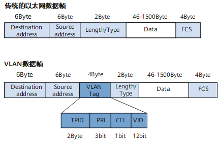

# VLAN

VLAN（Virtual Local Area Network）即虚拟局域网，是**将一个物理的 LAN 在逻辑上划分成多个广播域**的通信技术。每个 VLAN 是一个广播域，VLAN 内的主机间可以直接通信，而 VLAN 间则不能直接互通。这样，广播报文就被限制在一个 VLAN 内。

## VLAN 和子网的区别

VLAN 划分二层网络；子网划分三层网络。

## 报文

要使交换机能够分辨不同 VLAN 的报文，需要在报文中添加标识 VLAN 信息的字段。IEEE 802.1Q 协议规定，在以太网数据帧中加入 4 个字节的 VLAN 标签（又称 VLAN Tag，简称 Tag），用以标识 VLAN 信息。

VID 字段代表 VLAN ID，VLAN ID 取值范围是 0 ～ 4095。由于 0 和 4095 为协议保留取值，所以 VLAN ID 的有效取值范围是 1 ～ 4094。
交换机内部处理的数据帧都带有 VLAN 标签。而交换机连接的部分设备（如用户主机、服务器）只会收发不带 VLAN tag 的传统以太网数据帧。因此，要与这些设备交互，就需要交换机的接口能够识别传统以太网数据帧，并在收发时给帧添加、剥除 VLAN 标签。添加什么 VLAN 标签，由接口上的缺省 VLAN（Port Default VLAN ID，PVID）决定。

## 使用场景

### VLAN 间用户的二层隔离

某商务楼内有多家公司，为了降低成本，多家公司共用网络资源，各公司分别连接到一台二层交换机的不同接口，并通过统一的出口访问 Internet。可将每个公司所连接的接口划分到不同的 VLAN，实现公司间业务数据的完全隔离。可以认为每个公司拥有独立的“虚拟路由器”，每个 VLAN 就是一个“虚拟工作组”。

### VLAN 间用户的三层互访

可在 Switch_1 和 Switch_2 上划分 VLAN 并将 VLAN 透传到 Switch_3 上，然后在 Switch_3 上为每个 VLAN 配置一个 VLANIF 接口，实现 VLAN2 和 VLAN3 间的路由。

## VLAN 的接口类型

### Access 接口

Access 接口一般用于和不能识别 Tag 的用户终端（如用户主机、服务器）相连，或者不需要区分不同 VLAN 成员时使用。
交换机内部只处理 Tagged 帧，所以 Access 接口需要给收到的数据帧添加 VLAN Tag，也就必须配置缺省 VLAN。

### Trunk 接口

它可以允许多个 VLAN 的帧带 Tag 通过，但只允许属于缺省 VLAN 的帧从该类接口上发出时不带 Tag。

### Hybrid 接口

它可以允许多个 VLAN 的帧带 Tag 通过，且允许从该类接口发出的帧根据需要配置某些 VLAN 的帧带 Tag（即不剥除 Tag）、某些 VLAN 的帧不带 Tag（即剥除 Tag）。

## 相关协议

### IEEE 802.1Q

IEEE 802.1Q（也被称为 Dot1q）即 Virtual Bridged Local Area Networks 协议，规定了 VLAN 的实现标准。与标准的以太网数据帧相比，VLAN 数据帧增加了 1 个 4 字节的 VLAN 标签。

### LNP

链路类型协商协议（Link-type Negotiation Protocol，LNP）用来动态协商以太网接口的链路类型为 Access 或者 Trunk。
以太网接口的链路类型协商为 Access，缺省情况下加入 VLAN1。
以太网接口的链路类型协商为 Trunk，缺省情况下加入 VLAN1 ～ 4094。

### QinQ

QinQ（802.1Q-in-802.1Q）协议出自 IEEE 802.1ad 标准协议，通过在 802.1Q 标签报文的基础上再增加一层 802.1Q 的 Tag 来达到扩展 VLAN 空间的功能，可以使私网 VLAN 透传公网。

由于在骨干网中传递的报文有两层 802.1Q Tag（一层公网 Tag，一层私网 Tag），即 802.1Q-in-802.1Q，所以称之为 QinQ 协议。

## 参考

> https://info.support.huawei.com/info-finder/encyclopedia/zh/VLAN.html
