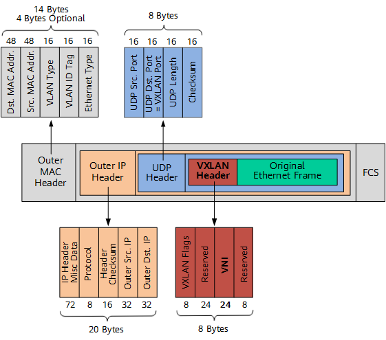

# 虚拟扩展局域网 （Virtual Extensible LAN, VXLAN）

VXLAN 即虚拟扩展局域网，是大二层网络中广泛使用的网络虚拟化技术。在源网络设备与目的网络设备之间建立一条逻辑 VXLAN 隧道，采用 MAC in UDP（User Datagram Protocol）封装方式，即，将虚拟机发出的原始以太报文完整的封装在 UDP 报文中，然后在外层使用物理网络的 IP 报文头和以太报文头封装，这样，封装后的报文就像普通 IP 报文一样，可以通过路由网络转发，这就像给二层网络的虚拟机插上了路由的翅膀，使虚拟机彻底摆脱了二、三层网络的结构限制。

## 为什么需要 VXLAN

- 虚拟机动态迁移,为了保证迁移时业务不中断，就要求在虚拟机迁移时，不仅虚拟机的 IP 地址不变，而且虚拟机的运行状态也必须保持原状（例如 TCP 会话状态），所以虚拟机的动态迁移只能在同一个二层域中进行，而不能跨二层域迁移。
- 海量租户隔离,在传统的 VLAN 网络中，标准定义所支持的可用 VLAN 数量只有 4000 个左右。服务器虚拟化后，一台物理服务器中承载了多台虚拟机，每个虚拟机都有独立的 IP 地址和 MAC 地址，相当于服务器成倍扩大了。例如，公有云或其它大型虚拟化云数据中心动辄需容纳上万甚至更多租户，VLAN 的能力显然已经力不从心。

### 报文

如上图所示，VXLAN Tunnel Endpoint (VTEP) 对 VM 发送的原始以太帧（Original L2 Frame）进行了以下“包装”：

- VXLAN Header
  增加 VXLAN 头（8 字节），其中包含 24 比特的 VNI 字段，用来定义 VXLAN 网络中不同的租户。此外，还包含 VXLAN Flags（8 比特，取值为 00001000）和两个保留字段（分别为 24 比特和 8 比特）。

- UDP Header
  VXLAN 头和原始以太帧一起作为 UDP 的数据。UDP 头中，目的端口号（VXLAN Port）固定为 4789，源端口号（UDP Src. Port）是原始以太帧通过哈希算法计算后的值。

- Outer IP Header
  封装外层 IP 头。其中，源 IP 地址（Outer Src. IP）为源 VM 所属 VTEP 的 IP 地址，目的 IP 地址（Outer Dst. IP）为目的 VM 所属 VTEP 的 IP 地址。

- Outer MAC Header
  封装外层以太头。其中，源 MAC 地址（Src. MAC Addr.）为源 VM 所属 VTEP 的 MAC 地址，目的 MAC 地址（Dst. MAC Addr.）为到达目的 VTEP 的路径中下一跳设备的 MAC 地址。
